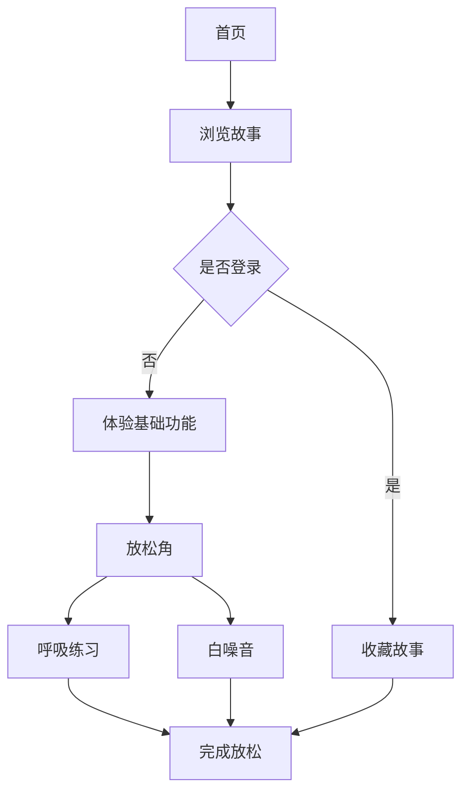

# 放松鸦 - 产品需求文档

## 1. 产品概述

**放松鸦**是一款以两只可爱松鸦为主角的治愈系网页应用。故事围绕焦虑的皮皮和放松的坡坡展开，通过温馨的互动故事、放松技巧和冥想练习，帮助用户缓解压力、找到内心的平静。产品目标用户为需要放松、缓解焦虑的人群，通过可爱的角色和轻松的内容传递正能量。

## 2. 核心功能

### 2.1 用户角色
| 角色 | 注册方式 | 核心权限 |
|------|----------|----------|
| 访客用户 | 无需注册 | 浏览故事、体验基础放松功能 |
| 注册用户 | 邮箱/手机注册 | 保存进度、自定义设置、解锁更多内容 |

### 2.2 功能模块
1. **首页（故事首页）**: 展示皮皮和坡坡的最新故事，提供快速进入放松功能的入口
2. **故事小屋**: 皮皮和坡坡的系列治愈故事，支持滚动阅读和收藏
3. **放松角**: 呼吸练习、冥想引导、白噪音等放松功能
4. **关于页面**: 介绍皮皮和坡坡的角色背景、创作理念

## 3. 核心流程

### 3.1 用户主要流程
```
用户打开网站 → 浏览首页故事 → 进入放松角 → 开始呼吸练习/听白噪音 → 收藏喜欢的内容
```

### 3.2 核心流程图


## 4. 用户界面设计

### 4.1 设计风格
- **主色调**: 温暖的橙黄色（代表阳光和温暖）+ 柔和的蓝色（代表平静）
- **辅助色**: 淡紫色（代表梦幻）、浅绿色（代表自然）
- **按钮风格**: 圆角卡片式，带有柔和阴影
- **字体选择**: 手写风格标题 + 圆润正文字体，营造温馨感
- **布局风格**: 卡片式布局，大量留白，打造舒适阅读体验
- **图标风格**: 可爱的鸟主题插画和表情符号

### 4.2 页面设计概览
| 页面名称 | 模块名称 | UI元素描述 |
|----------|----------|------------|
| 首页 | 故事Banner | 皮皮和坡坡的大图插画，配合云朵和树林背景 |
| 首页 | 快速入口卡片 | 3个圆润的图标卡片：呼吸练习、白噪音、睡前故事 |
| 故事小屋 | 故事卡片列表 | 竖向滚动的故事卡片，带有可爱的松鸦头像 |
| 放松角 | 呼吸动画区 | 中央大圆形呼吸指示器，配合动画效果 |
| 放松角 | 白噪音控制 | 音量滑块+多个白噪音选择按钮 |
| 关于页面 | 角色介绍 | 皮皮和坡坡的左右分栏对比介绍 |

### 4.3 响应式设计
- 采用移动优先设计理念
- 移动端：单栏布局，大触摸目标
- 平板端：双栏网格布局
- 桌面端：三栏布局，最大化内容展示

### 4.4 App可下载性
- 使用PWA（渐进式网页应用）技术
- 支持"添加到主屏幕"功能
- 支持离线浏览已缓存内容
- 原生App般流畅的滑动和动画体验

## 5. 内容规划

### 5.1 故事系列
1. **皮皮的焦虑日记**: 皮皮面对考试、社交等情境时的焦虑经历
2. **坡坡的放松秘籍**: 坡坡分享的各种放松技巧和生活智慧
3. **一起成长**: 皮皮和坡坡互相帮助、共同成长的温馨故事

### 5.2 放松功能
1. **呼吸练习**: 4-7-8呼吸法、三段式呼吸、可视化呼吸球
2. **白噪音**: 雨声、森林声、海浪声、壁炉声
3. **简短冥想**: 5分钟正念冥想、身体扫描放松

## 6. 技术可行性

本项目将采用现代化的前端技术栈，确保良好的用户体验和跨平台兼容性。通过PWA技术实现App般的体验，同时保持轻量级和快速加载。
