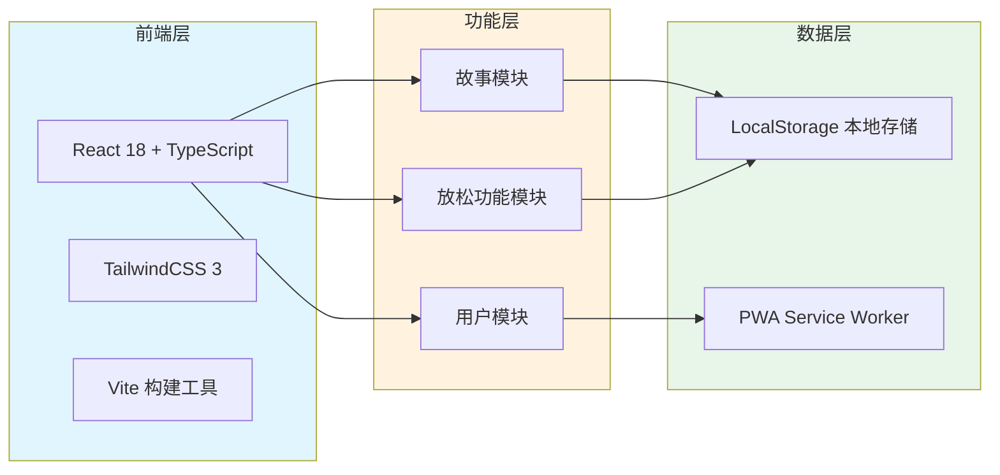
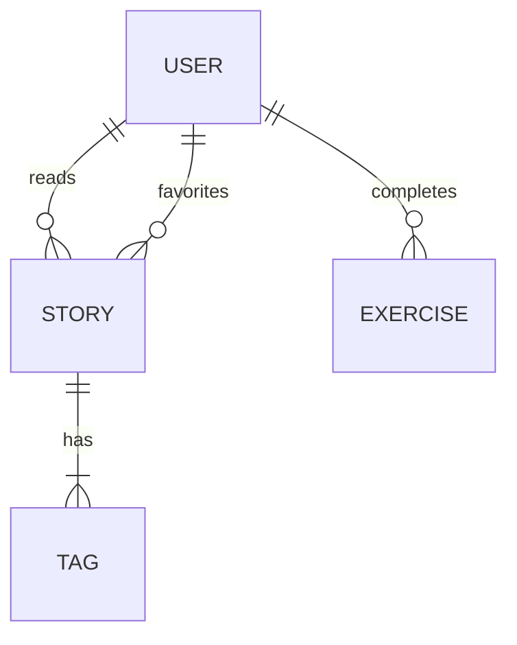

# 放松鸦 - 技术架构文档

## 1. 架构设计

### 1.1 整体架构


## 2. 技术选型

- **前端框架**: React 18 + TypeScript
- **样式方案**: TailwindCSS 3（响应式设计）
- **构建工具**: Vite 5（快速开发和构建）
- **状态管理**: React Context API（适合中小型应用）
- **数据存储**: LocalStorage（用户偏好和进度）
- **离线支持**: PWA Service Worker
- **图标资源**: Lucide React（现代图标库）

## 3. 路由定义

| 路由 | 目的 | 组件 |
|------|------|------|
| `/` | 首页，展示最新故事和快速入口 | `HomePage` |
| `/stories` | 故事小屋，故事列表页 | `StoriesPage` |
| `/stories/:id` | 单个故事详情页 | `StoryDetailPage` |
| `/relax` | 放松角主页 | `RelaxPage` |
| `/about` | 关于页面 | `AboutPage` |

## 4. 核心组件结构

```
src/
├── components/
│   ├── layout/
│   │   ├── Header.tsx          # 网站头部导航
│   │   └── Footer.tsx          # 网站底部
│   ├── home/
│   │   ├── Hero.tsx            # 首页大图横幅
│   │   └── QuickAccess.tsx     # 快速功能入口
│   ├── stories/
│   │   ├── StoryCard.tsx       # 故事卡片组件
│   │   └── StoryContent.tsx    # 故事内容展示
│   ├── relax/
│   │   ├── BreathCircle.tsx    # 呼吸练习动画
│   │   └── WhiteNoisePanel.tsx # 白噪音控制面板
│   └── common/
│       ├── Button.tsx          # 通用按钮
│       └── Card.tsx            # 通用卡片
├── pages/
│   ├── HomePage.tsx
│   ├── StoriesPage.tsx
│   ├── StoryDetailPage.tsx
│   ├── RelaxPage.tsx
│   └── AboutPage.tsx
├── data/
│   └── stories.ts              # 故事数据
├── hooks/
│   ├── useLocalStorage.ts      # 本地存储Hook
│   └── useBreathExercise.ts    # 呼吸练习Hook
├── context/
│   └── UserContext.tsx         # 用户状态管理
├── types/
│   └── index.ts                # TypeScript类型定义
├── App.tsx                     # 应用主入口
└── main.tsx                    # React渲染入口
```

## 5. PWA配置

```typescript
// vite.config.ts PWA插件配置
VitePWA({
  registerType: 'autoUpdate',
  workbox: {
    globPatterns: ['**/*.{js,css,html,ico,png,svg,woff2}'],
    runtimeCaching: [
      {
        urlPattern: /^https:\/\/fonts\.googleapis\.com/,
        handler: 'CacheFirst',
      }
    ]
  },
  manifest: {
    name: '放松鸦',
    short_name: '放松鸦',
    description: '皮皮和坡坡的治愈故事',
    theme_color: '#FF9800',
    background_color: '#FFF8E1',
    display: 'standalone',
    icons: [...]
  }
})
```

## 6. 数据模型

### 6.1 故事数据模型
```typescript
interface Story {
  id: string;
  title: string;
  character: 'pipi' | 'popo' | 'both';
  category: 'anxiety' | 'relax' | 'growth';
  content: string;
  audioUrl?: string;
  createdAt: string;
}

interface UserProgress {
  readStories: string[];      # 已阅读故事ID列表
  favorites: string[];        # 收藏故事ID列表
  completedExercises: string[]; # 已完成练习ID列表
  lastVisit: string;           # 最后访问时间
}
```

### 6.2 数据关系图


## 7. 性能优化策略

1. **代码分割**: 使用React.lazy进行路由级代码分割
2. **图片优化**: 使用WebP格式，配合响应式图片srcset
3. **懒加载**: 图片和组件使用Intersection Observer懒加载
4. **PWA缓存**: Service Worker缓存静态资源和API响应
5. **预加载关键资源**: 使用<link rel="preload">预加载关键字体和脚本

## 8. 浏览器兼容性

- Chrome/Edge 90+
- Safari 14+
- Firefox 88+
- 移动端Safari和Chrome全支持

## 9. 开发工具链

- **包管理**: npm
- **代码规范**: ESLint + Prettier
- **版本控制**: Git + GitHub
- **部署平台**: GitHub Pages（静态部署）
